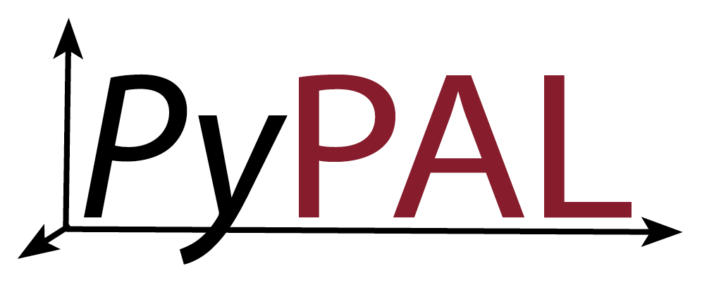

[](https://codecov.io/gh/kjappelbaum/PyPAL)


Generalized Python implementation of the ε-PAL algorithm [[1](#1), [2](#2)].

## Installation

To install the latest development version from the head use

```(bash)
pip install git+https://github.com/kjappelbaum/PyPAL.git
```

To install a stable release use

```(bash)
pip install PyPAL
```

Developers can install the extras `[testing, docs, pre-commit]`.

## Usage

The main logic is implemented in the `PALBase` class. There are some pre-built classes for common use-cases (`GPy`, `sklearn`) that inherit from this class.

### Pre-Built classes

#### scikit-learn

If you want to use a list of [sklearn](https://scikit-learn.org/stable/index.html) models, you cam use the `PALSklearn` class.

#### GPy

If you want to use a list of [GPy](https://sheffieldml.github.io/GPy/) models, you can use the `PALGPy` class.

#### Coregionalized GPR

Coregionalized GPR models can harvest correlations between the objectives and also work in the cases in which some of the objectives are not measured for all samples.

### Custom classes

You will need to implement the `_train()` and `_predict()` functions if you inherit from `PALBase`. If you want to tune the hyperparameters of your models while new training points are added, you can implement a schedule by setting the `_should_optimize_hyperparameters()` function and the `_set_hyperparameters()` function which sets the hyperparameters for the model(s).

If you need to train a model, `self.design_space` is the feature matrix you want to use and `self.y` is the target vector. Note that in `self.y` all objectives are turned into maximization problems. This is, if one of your problems is a minimization problem, we will flip its sign in `self.y`.

A basic example of how a custom class can be implemented is the `PALSklearn` class:

```python
class PALSklearn(PALBase):
    """PAL class for a list of Sklearn (GPR) models, with one model per objective"""

    def __init__(self, *args, **kwargs):
        super().__init__(*args, **kwargs)

        validate_number_models(self.models, self.ndim)

    def _train(self):
        for i, model in enumerate(self.models):
            model.fit(self.design_space[self.sampled], self.y[self.sampled, i].reshape(-1,1))

    def _predict(self):
        means, stds = [], []
        for model in self.models:
            mean, std = model.predict(self.design_space, return_std=True)
            means.append(mean.reshape(-1, 1))
            stds.append(std.reshape(-1, 1))

        self.means = np.hstack(mean)
        self.std = np.hstack(stds)
```

For scheduling for the hyperparameter optimization we have some predefined schedules in the `PyPAL.pal.schedules` module.

### Test the algorithms

If the full design space is known, you can use a while loop to fully explore the space.
For the theoretical guarantees to hold, you'll need to sample until all uncertainties are below epsilon. In practice, it is usually enough to require as termination criterion that there a no unclassified samples left.

## References

1. <a name="1"></a> Zuluaga, M.; Krause, A.; Püschel, M. E-PAL: An Active Learning Approach to the Multi-Objective Optimization Problem. Journal of Machine Learning Research 2016, 17 (104), 1–32.
2. <a name="2"></a> Zuluaga, M.; Sergent, G.; Krause, A.; Püschel, M. Active Learning for Multi-Objective Optimization; Dasgupta, S., McAllester, D., Eds.; Proceedings of machine learning research; PMLR: Atlanta, Georgia, USA, 2013; Vol. 28, pp 462–470.

## Acknowledgments

The research was supported by the European Research Council (ERC) under the European Union’s Horizon 2020 research and innovation programme ([grant agreement 666983, MaGic](https://cordis.europa.eu/project/id/666983)), by the [NCCR-MARVEL](https://www.nccr-marvel.ch/), funded by the Swiss National Science Foundation, and by the Swiss National Science Foundation (SNSF) under Grant 200021_172759. Part of the work was performed during the [Explore Together internship program at BASF](https://www.basf.com/global/en/careers/students/explore-together.html).
