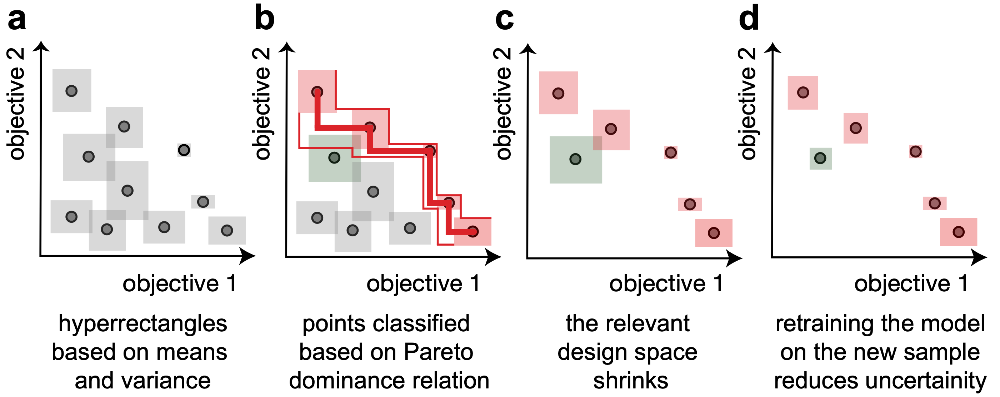
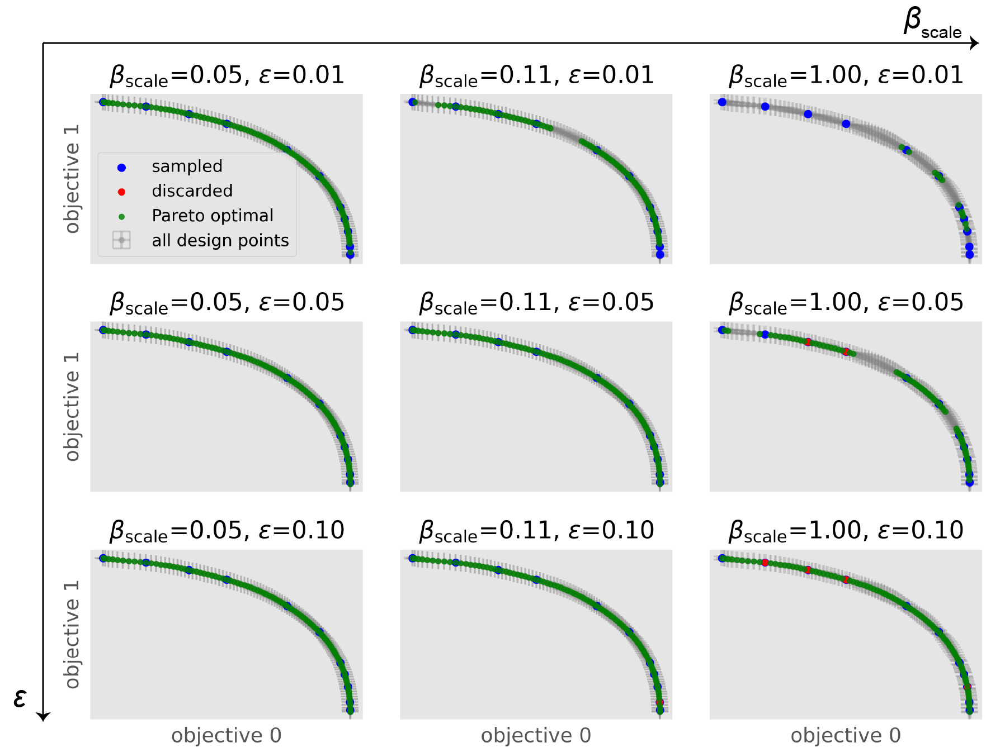

Background
===========

This package implements a modified version of the `ε-PAL algorithm from Zuluaga et al. <https://jmlr.org/papers/v17/15-047.html>`_ in an object-oriented interface for finding the Pareto efficient points in any number of dimensions with any model that can output a standard deviation and a mean.

This implementation has the following features:

- We make sure that the sampling is scale invariant and that the algorithm can deal with positive and negative objective values.

- Instead of using the predicted :math:`\hat{\mu}` and :math:`\hat{\sigma}` also for the sampled points we use the measured :math:`\mu` and :math:`\sigma`.

- This implementation is directly applicable to :math:`n`-dimensional problems.

- It can be easily used with any kind of model. For example, one might replace the Gaussian process model with a neural network with `Dropout Monte Carlo <http://proceedings.mlr.press/v48/gal16.pdf>`_ for the uncertainty estimate.

- The support for missing data is implemented. For example, if you measure for some points only some of the objectives there is nothing else you have to do other than providing `np.nan` for the missing measurements. The code will figure the rest out for you and if you use some models like coregionalized GPRs, the models will try to use the correlations between the objectives to fill the gaps.

In our own work, we used this algorithm for materials discovery.

Intuition behind the algorithm
--------------------------------

The PAL algorithm iterates the following steps:

a. Training a machine learning model to predict means and standard deviations for all points of the design space. This can be used to construct hyperrectangles.

b. Using those points, we can use the Pareto dominance relation to classify points as Pareto optimal or to discard them.
   In some cases, e.g., when hyperrectangles overlap, we will not be able to perform a classification with confidence.
   This is different from many Bayesian optimization approaches, that introduce some expected improvement function to that introduce a total order in the design space and hence bias the search.

c. Since in step b we discard many points (with confidence) the effective design space shrinks. We now can sample the next experiment from the Pareto optimal and unclassified points. Since the ultimate goal is to perform a classification of the full design space—with confidence—we sample the point with the largest hyperrectangle.

d. Retraining a model with this new measurement will reduce the width of the hyperrectangles.

How do the hyperparameters influence the algorithm?
-----------------------------------------------------

To test the influence of hyperameter settings we ran one step of the algorithm
on the `Binh-Korn testfunction <https://en.wikipedia.org/wiki/Test_functions_for_optimization#Test_functions_for_multi-objective_optimization>`_.

We model every objective seperately with a Matérn-3/2 kernel, leave :math:`\delta=0.05` fixed
and vary :math:`\epsilon` and :math:`\beta_\mathrm{scale}`.

We find that increasing :math:`\epsilon` speeds up the algorithm, but gives us a sparser Pareto frontier.
Similarily, :math:`\beta_\mathrm{scale}` speeds up the algorithm by scaling the size of the hyperrectangles.

