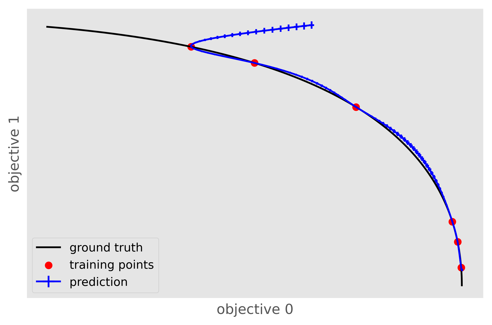
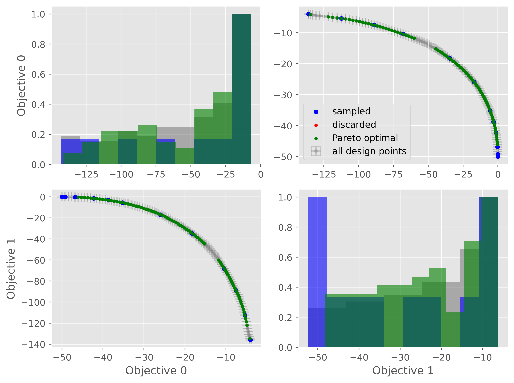

Getting Started
================

Installation
---------------

We recommend installing PyePAL in a dedicated `virtual environment <https://docs.python.org/3/tutorial/venv.html>`_ or `conda environment <https://docs.conda.io/projects/conda/en/latest/user-guide/tasks/manage-environments.html>`_.

To install the latest stable release use

.. code-block:: bash

    pip install pyepal

The latest version of PyePAL can be installed from GitHub using

.. code-block:: bash

    pip install git+https://github.com/kjappelbaum/pyepal.git

On MacOS you might need to install `libomp` (e.g., `brew install libomp`) for multihreading in some of the models.

Which class do i use?
-----------------------

- For Gaussian processes built with :code:`sklearn` use :py:class:`~pyepal.pal.pal_sklearn.PALSklearn`
- For Gaussian processes built with :code:`GPy` use :py:class:`~pyepal.pal.pal_gpy.PALGPy`
- For coregionalized Gaussian processes (built with :code:`GPy`) use :py:class:`~pyepal.pal.pal_coregionalized.PALCoregionalized`
- For quantile regression using :code:`LightGBM` gradient boosted decision trees use :py:class:`~pyepal.pal.pal_gbdt.PALGBDT`
- For `infinite wide neural networks with the neural tangent kernel or exact Bayesian inference (Novak et al., 2019) <https://arxiv.org/pdf/1912.02803.pdf>`_ use :py:class:`~pyepal.pal.pal_neutral_tangent.PALNT`
- For an `ensemble of finite width neural networks (Lakshminarayanan et al., 2017) <https://proceedings.neurips.cc/paper/2017/file/9ef2ed4b7fd2c810847ffa5fa85bce38-Paper.pdf>`_ (built with JAX) use :py:class:`~pyepal.pal.pal_finite_ensemble.PALNTEnsemble`

If your favorite model is not listed, you can easily implement it yourself (see :ref:`new_pal_class`)!

Running an active learning experiment
---------------------------------------

The `examples` directory contains a `Jupyter notebook with an example <https://github.com/kjappelbaum/pyepal/blob/master/examples/test_pal.ipynb>`_ that can also be run on MyBinder.

If using a Gaussian process model built with :code:`sklearn` or :code:`GPy` we recommend using a pre-built class such as :py:class:`~pyepal.pal.pal_sklearn.PALSklearn`,  :py:class:`~pyepal.pal.pal_coregionalized.PALCoregionalized`,  :py:class:`~pyepal.pal.pal_gpy.PALGPy` and following the subsequent steps (for more details on which class to use see :ref:`Which class do i use?`):

1. For each objective create a model (if using a coregionalized Gaussian process model, only one model needs to be created)

2. Sample a few initial points from the design space. We provide the :py:meth:`~pyepal.pal.utils.get_maxmin_samples` or :py:meth:`~pyepal.pal.utils.get_kmeans_samples` utilities that can help with the sampling. Our code assumes that :code:`X` is a :code:`np.array`.

    .. code-block:: python

        from pyepal import get_kmeans_samples, get_maxmin_samples

        # This selects the 10 points closest to the centroids of a k=10 means clustering
        indices = get_kmeans_samples(X, 10)

        # This selects the 10 farthest points in feature space
        indices = get_maxmin_samples(X, 10)

3. Now we can initialize the instance of one :code:`PAL` class. If using a :code:`sklearn` Gaussian process model, we would use

    .. code-block:: python

        from pyepal import PALSklearn

        # Each of these models is an instance of sklearn.gaussian_process.GaussianProcessRegressor
        models = [gpr0, gpr1, gpr2]

        # We always need to provide the feature matrix (X), a list of models, and the number of objectives
        palinstance = PALSklearn(X, models, 3)

        # Now, we can also feed in the first measurements
        # this here assumes that we have all measurements for y and we now
        # provide those which are present in the indices array
        palinstance.update_train_set(indices, y[indices])

        # Now we can run one step
        next_idx = palinstance.run_one_step()

    At this level, we have a range of different optional arguements we can set.

    - :code:`epsilon`: one :math:`\epsilon` per dimension in a :code:`np.ndarray`. This can be used to set different tolerances for each objective. Note that :math:`\epsilon_i \in [0,1]`.
    - :code:`delta`: the :math:`\delta` hyperparameter (:math:`\delta \in [0,1]`). Increasing this value will speed up the convergence.
    - :code:`beta_scale`: an empirical scaling parameter for :math:`\beta`. The theoretical guarantees in the PAL paper are derived for this parameter set to 1. But in practice, a much faster convergence can be achieved by setting it to a number :math:`0< \beta_\mathrm{scale} \ll 1`.
    - :code:`goal`: By default, PyePAL assumes that the goal is to maximize every objective. If this is not the case, this argument can be set using a list of "min" and "max" strings, with "min" specifying whether to minimize the ith objective and "max" indicating whether to maximize this objective.
    - :code:`coef_var_threshold`: By default, PyePAL will not consider points with a coefficient of variation :math:`\ge 3` for the classification step of the algorithm. This is meant to avoid classifying design points for which the model is entirely unsure. This tends to happen when a model is severely overfit on the training data (i.e., the training data uncertainties are very low, whereas the prediction uncertainties are very high). To change this setting, reduce this value to make the check tighter or increase it to avoid this check (as in the original implementation).

In the case of missing observations, i.e., only two of three outputs are measured, report the missing observations as :code:`np.nan`. The call could look like

.. code-block:: python

    import numpy as np

    palinstance.update_train_set(np.array([1,2]), np.array([[1, 2, 3], [np.nan, 1, 2, 0]]))

for a case in which we performed measurements for samples with index 1 and 2 of our design space, but did not measure the first target for sample 2.

Hyperparameter optimization
.............................
Usually, the hyperparameters of a machine learning model, in particular the kernel hyperparameters of a Gaussian process regression model, should be optimized as new training data is added.
However, since this is usually a computationally expensive process, it may not be desirable to perform this at every iteration of the active learning process. The iteration frequency of the hyperparameter optimization is internally set by the :code:`_should_optimize_hyperparameters` function, which by default uses a schedule that optimizes the hyperparameter every 10th iteration. This behavior can be changed by override this function.

Logging
........
Basic information such as the current iteration and the classification status are logged and can be viewed by printing the :code:`PAL` object

.. code:: python

    print(palinstance)

    # returns: pyepal at iteration 1. 10 Pareto optimal points, 1304 discarded points, 200 unclassified points.

We also provide calculation of the hypervolume enclosed by the Pareto front with the function :py:meth:`~pyepal.pal.utils.get_hypervolume`

.. code:: python

    hv = get_hypervolume(palinstance.means[palinstance.pareto_optimal])

Properties of the PAL object
..............................
For debugging there are some properties and attributes of the `PAL` class that can be used to inspect the progress of the active learning loop.

- get the points in the design space, :code:`x`:
    - :code:`design_space` returns the full design space matrix
    - :code:`pareto_optimal_points`: returns the points that are classified as Pareto-efficient
    - :code:`sampled_points`: returns the points that have been sampled
    - :code:`discarded_points`: returns the points that have been discarded
- get the indices of Pareto efficent, sampled,  discarded, and unclassified points with :code:`pareto_optimal_indices`, :code:`sampled_indices`, :code:`discarded_indices`, and :code:`unclassified_indices`
- similarly, the number of points in the different classes can be obtained using :code:`number_pareto_optimal_points`, :code:`number_discarded_points`, :code:`number_unclassified_points`, and :code:`number_sampled_points`. The total number of design points can be obtained with :code:`number_design_points`.
- :code:`hyperrectangle_size` returns the sizes of the hyperrectangles, i.e., the weights that are used in the sampling step
- :code:`means` and :code:`std` contain the predictions of the model
- :code:`sampled` is a mask array. In case one objective has not been measured its cell is :code:`False`

Exploring a space where all objectives are known
.................................................

In some cases, we may already posess all measurements, but would like to run PAL with different settings to test how the algorithm performs.
In this case, we provide the :py:meth:`~pyepal.pal.utils.exhaust_loop` wrapper.

.. code-block:: python

    from pyepal import PALSklearn, exhaust_loop
    models = [gpr0, gpr1, gpr2]
    palinstance = PALSklearn(X, models, 3)

    exhaust_loop(palinstance, y)

This will continue calling :code:`run_one_step()` until there is no unclassified sample left.

Batch sampling
................

By default, the :code:`run_one_step` function of the PAL classes will return a :code:`np.ndarray` with only one index for the point in the design space for which the next experiment should be performed. In some situations, it may be more practical to run multiple experiments as batches before running the next active learning iteration. In such cases, we provide the :code:`batch_size` argument which can be set to an integer greater than one.

.. code-block:: python

    next_idx = palinstance.run_one_step(batch_size=10)
    # next_idx will be a np.array of length 10

Note that the `exhaust_loop` also supports the `batch_size` keyword argument

.. code-block:: python

    palinstance = PALSklearn(X, models, 3)

    # sample always 10 points and do this until there is no unclassified
    # point left
    exhaust_loop(palinstance, y, batch_size=10)

Adding new points to the design matrix
........................................

In some applications, you might want to augment the design matrix after a few iterations of PyePAL. This could be useful, for example, if you start with a coarse discretization of your design space then want to refine this grid in subsequent iterations in the relevant regions of the design space.

Adding new points to the design matrix can be easily achieved using the :py:func:`~pyepal.pal.pal_base.PALBase.augment_design_matrix` function that takes the new design matrix as input. By default, it will run the current model for the new, augmented, design matrix, and re-classify all points. You can turn this behavior off using the :code:`clean_classify` parameter.

Alternatively, you can use the :code:`classify` flag that keeps all previous classifications. This means that if there is a point that was previously Pareto-efficient in the non-augmented design space but is now dominated by a new design point, it will no longer certainly be classified as Pareto-efficient.

Note that is important that the new points are sampled from the same distribution as the previous points in the design space. Otherwise, the model will have to deal with unexpected data shift.

Caveats and tricks with Gaussian processes
-------------------------------------------

One caveat to keep in mind is that :math:`\epsilon`-PAL will not work if the predictive variance does not make sense, for example, when the model is overconfident and the uncertainties for the training set is significantly lower than those for the predicted set. In this case, PyePAL will untimely, and often incorrectly, label the design points. An example situation where the predictions for an overconfident model due to a training set that excludes a part of design space is shown in the figure below

This problem is exacerbated in conjunction with :math:`\beta_\mathrm{scale} < 1`. To make the model more robust we suggest trying:

- to set reasonable bounds on the length scale parameters
- to increase the regularization parameter/noise kernel (:code:`alpha` in :code:`sklearn`)
- to increase the number of data points, especially the coverage of the design space
- `to use a kernel that suits the problem <https://www.cs.toronto.edu/~duvenaud/cookbook/>`_
- to turn off ARD. Automatic relevance determination (ARD) might increase the predictive performance, but also makes the model more prone to overfitting

We also recommend cross-validating the Gaussian process models and checking that the predicted variances make sense. When performing cross-validation, make sure that the index provided to PyePAL is the same size as the cross-validation folds.
By default, the code will run a simple cross-validation only on the first iteration and provide a warning if the mean absolute error is above the mean standard deviation. The warning will look something like

.. code-block::

    The mean absolute error in cross-validation is 64.29, the mean variance is 0.36.
    Your model might not be predictive and/or overconfident.
    In the docs, you find hints on how to make GPRs more robust.

This behavior can changed with the cross-validation test being performed more frequently by overriding the :code:`should_run_crossvalidation` function.

Another way to detect overfitting is to use :py:func:`~pyepal.plotting.plot_jointplot` function from the plotting subpackage. This function will plot all objectives against each other (with errorbars and different classes indicated with colors) and histograms of the objectives on the diagonal. If the majority of predicted points tend to overlap one another and get discarded by PyePAL, this may suggest that the surrogate model is overfitted.

.. code-block:: python

    from pyepal.plotting import plot_jointplot

    # palinstance is a instance of a PAL class after
    # calling run_one_step
    fig = plot_jointplot(palinstance.means, palinstance)

