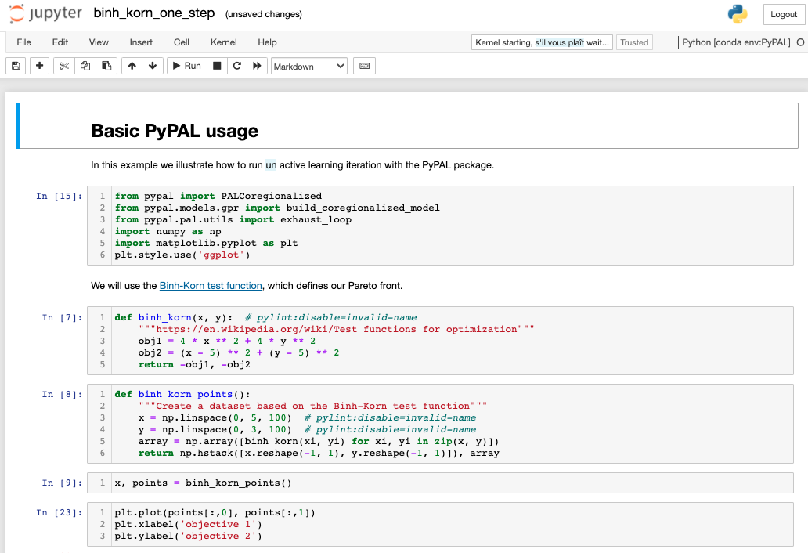
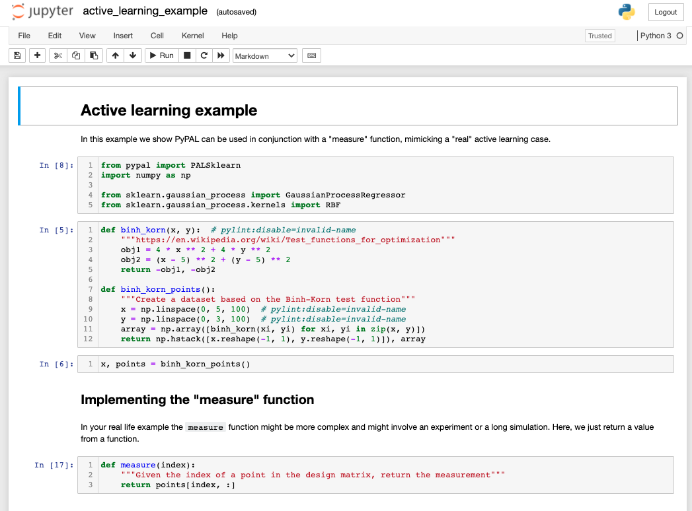
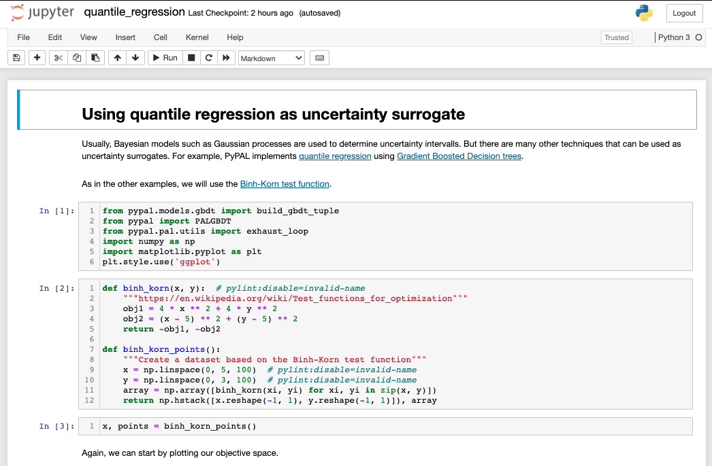
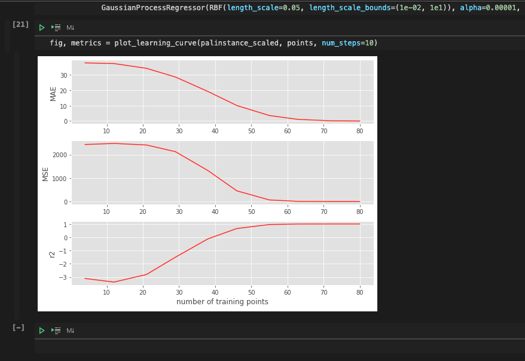

Tutorials
============

To explore different use cases of PyePAL, we recommend checking out the `example notebooks <https://github.com/kjappelbaum/pyepal/tree/main/examples>`_.
All notebooks can be run without installation on MyBinder. In the folder you find the notebooks with pre-executed output cells. Rerunning them
should take no more than a few minutes.

1. One active learning step using GPR models built with :code:`GPy`
----------------------------------------------------------------------

Topic covered
................

- building a pal_coregionalized GPR model using :py:meth:`~pyepal.pal.models.gpr.build_coregionalized_model`
-  using coregionalized models with :py:class:`~pyepal.pal.pal_coregionalized.PALCoregionalized`
- attributes of the :code:`PAL` instance
- :py:meth:`~pyepal.pal.utils.exhaust_loop`

2. Active learning with "measure" function and :code:`sklearn` models
-----------------------------------------------------------------------

Topic covered
................

- using :code:`sklearn`  models with :py:class:`~pyepal.pal.pal_sklearn.PALSklearn`
- selecting an initial set with :py:meth:`~pyepal.pal.utils.get_maxmin_samples`
- plotting with :py:meth:`~pyepal.plotting.plot_jointplot`

3. Quantile regression
-----------------------

- Using LightGBM models with quantile loss with :py:class:`~pyepal.pal.pal_gbdt.PALGBDT`
- selecting an initial set with :py:meth:`~pyepal.pal.utils.get_kmeans_samples`

4. Plotting a learning curve
-------------------------------

- Using `sklearn` Gaussian process models with RBF kernels
- Plotting learning curves
